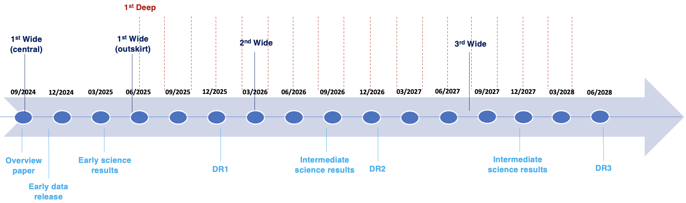

  

NEXUS is a JWST Multi-Cycle (Cycles 3-5) GO Treasury imaging and spectroscopic survey around the North Ecliptic Pole. The JWST observations include two overlapping tiers. The Wide tier covers ~400 arcmin2 with NIRCam/WFSS 2.4-5 micron grism spectroscopy (in F444W and F322W2), accompanied by NIRCam and MIRI imaging. The Wide area will be visited once in each of the three cycles. The Deep tier covers ~50 arcmin2 of the central Wide area, with NIRSpec/MSA 0.6-5.3 micron spectroscopy (PRISM) for 18 epochs with a 2-month cadence. This allows NIRSpec/MSA spectroscopy for more than 10,000 targets.

NEXUS will assemble a massive spectroscopic sample for faint sources to study galaxies, AGNs, and brown dwarfs, and enable a systematic exploration of time-domain science (such as high-redshift supernovae) in this JWST legacy field.

  

  <aside class="about-overview__image">
    
  </aside>

The NEXUS field center is: 17:53:51+65:11:57. The NEXUS footprint is shown below.

The approximate schedule of NEXUS is shown below.

